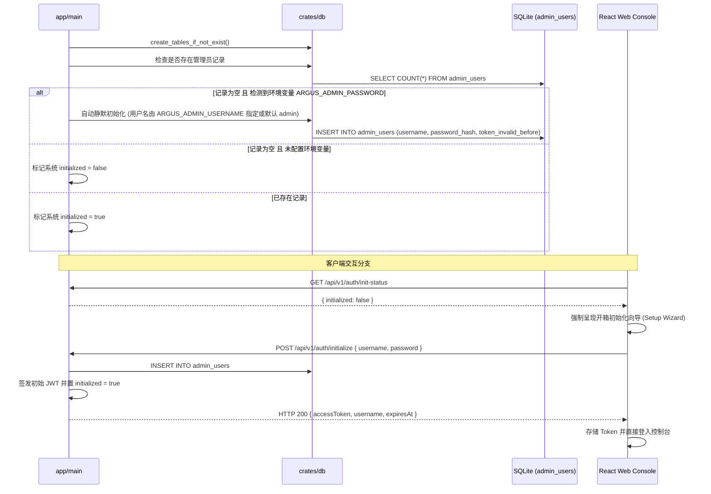
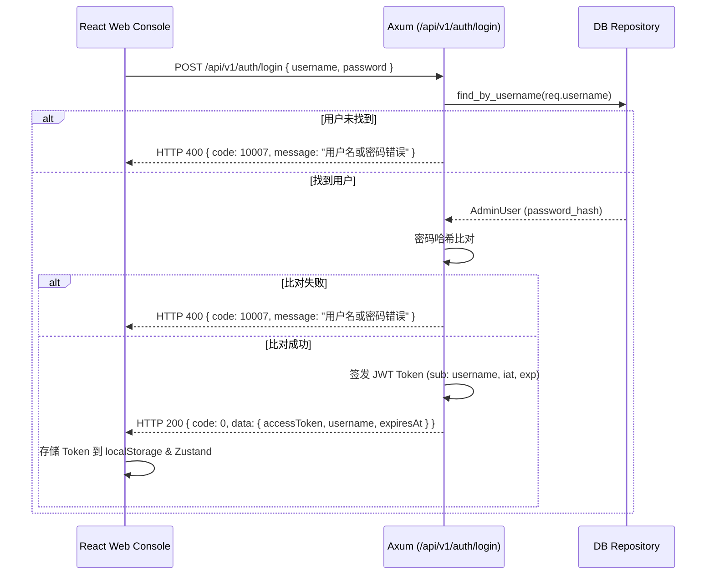
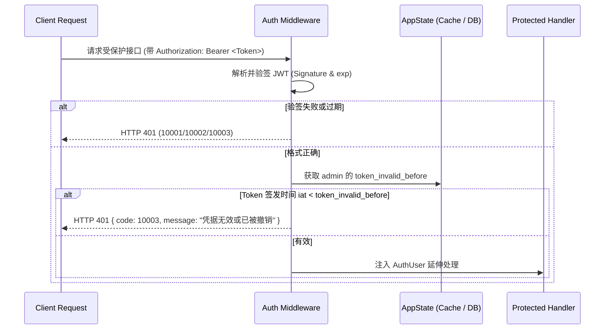

# Technical Design: User Authentication & Password Management

## 1. 架构定位与目录边界

按照 Argus 单向依赖体系与职责收敛原则：

| 层次 / 模块 | 目录路径 | 职责与归属 |
|---|---|---|
| **共享契约** | `crates/types/src/auth.rs` | 领域模型 `AdminUser`、JWT 声明 `AuthClaims`、请求/响应 DTO |
| **持久化仓储** | `crates/db/src/entity/admin_user.rs`<br/>`crates/db/src/repository/admin_user.rs` | `admin_users` 表 DDL、启动无感初始化、密码校验与更新、Token 撤销记录 |
| **API 服务层** | `crates/api/src/routes/auth.rs`<br/>`crates/api/src/middleware/auth.rs` | JWT 签发与验签、密码哈希逻辑、Axum 鉴权中间件与 `AuthUser` 提取器、操作日志脱敏 |
| **前端呈现** | `web/src/stores/auth.ts`<br/>`web/src/features/auth/`<br/>`web/src/components/ChangePasswordModal.tsx` | 登录交互、Token 持久化、请求拦截器与 401 自动失效联动、修改密码弹窗 |

---

## 2. 数据流与时序设计

### 2.1 启动判定与双轨初始化 (Bootstrap & OOBE Setup)



### 2.2 登录鉴权与 JWT 签发 (Login Flow)



### 2.3 受控接口拦截与瞬时撤销判定 (Middleware Flow)



---

## 3. 密码学选型与安全设计

### 3.1 密码哈希方案
- 采用加盐哈希（`salt` + SHA-256 迭代计算 / PBKDF2），格式形如：`$pbkdf2-sha256$i=10000$salt$hash`。
- 保证每个管理员实例拥有独立的随机 Salt，避免彩虹表碰撞。
- 密码比对采用常数时间比较（Constant-time comparison），抵御时序攻击（Timing Attack）。

### 3.2 JWT 签名与密钥管理
- 采用标准 HMAC-SHA256（HS256）。
- Secret 优先从环境变量 `ARGUS_JWT_SECRET` 读取；未配置时使用启动时自动生成的持久化随机密钥（32 字节高熵），保证安全性。
- Claims：
  ```json
  {
    "sub": "admin",
    "iat": 1747584000000,
    "exp": 1747670400000
  }
  ```
  统一以 13 位 UTC Unix 毫秒为单位，与系统契约完全一致。

### 3.3 Token 撤销性能保障
- 在系统高频请求路径上，为避免每次鉴权都穿透查库，在 `AppState` 中使用原子整型 `Arc<AtomicI64>` 缓存当前的 `token_invalid_before`。
- 首次从数据库读取加载；修改密码或登出时，先持久化写入数据库，随后原子更新内存缓存，实现 $O(1)$ 极速判定且断电后依然有效。

---

## 4. 操作审计日志敏感数据脱敏设计

- 在 `crates/api/src/routes/oplog.rs` 及审计中间件中：
  - 拦截写操作的 Request Body（JSON 结构）；
  - 递归检测键名为 `password`, `oldPassword`, `newPassword`, `token` 的字段；
  - 替换其值为 `"******"`；
  - 确保即使管理员修改密码，数据库 `operation_logs` 表的 `body` 字段亦绝不留存任何明文凭证。

---

## 5. 服务端国际化 (i18n) 设计

- **协议与请求感知**：
  - 提取客户端 `Accept-Language` 请求头（支持 `zh-CN`, `zh-TW`, `en` 等 BCP-47 规范）；
  - 前端 API 客户端发送请求时自动附带当前语言（`i18n.language`）。
- **零侵入中间件拦截**：
  - 在 `crates/api/src/middleware/i18n.rs` 中，对所有出站 JSON 响应进行透明拦截；
  - 根据业务状态码（`code`）及语言，将响应体中的 `message` 字段转换为目标语言；
  - 自动向响应头注入 `Content-Language: <lang>`，完全符合 RFC HTTP 国际化规范；
  - 兼顾直接通过 curl、第三方对接或前端调用，体验高度一致。
