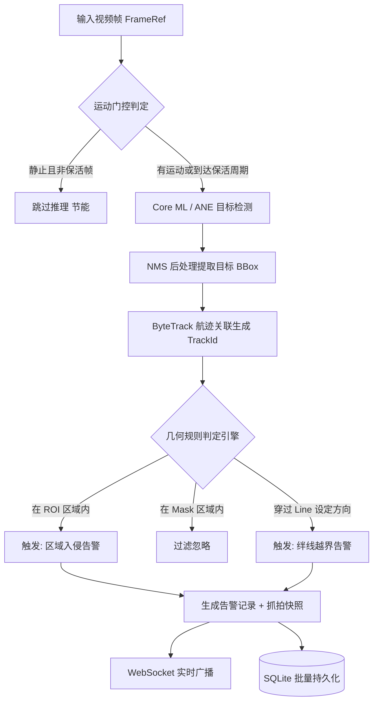
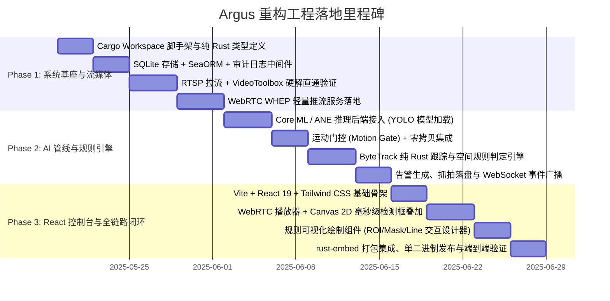

# Argus / Heimdall 边缘端一体化 AI 视频分析系统 产品需求文档 (PRD)

| 文档版本 | 创建时间 | 负责人 | 评审状态 | 目标形态 |
|---|---|---|---|---|
| **V1.0** | 2025-05-18 | Antigravity 架构组 | 待评审 | 纯 Rust 单一可执行文件 (All-in-One Binary) + React 现代化内嵌控制台 |

---

## 1. 文档概述与修订历史

### 1.1 修订记录

| 版本号 | 修订日期 | 修订人 | 修订说明 |
|---|---|---|---|
| V1.0 | 2025-05-18 | 架构组 | 首发正式稿：明确自 `/Users/zhang/dev/go/argus` 重构为 Rust 单二进制系统；确定砍掉传统企业级多用户 RBAC、保留核心操作审计日志；确定首发基于 Apple Silicon (ANE/CoreML) 的 YOLO 通用目标检测管线与 WebRTC 超低延迟流媒体传输。 |

### 1.2 名词解释与关键术语

| 术语 / 缩写 | 英文全称 | 说明 |
|---|---|---|
| **All-in-One Binary** | 单一可执行文件 | 系统构建产物为一个独立的二进制程序（`argus`），无需外挂动态库、无 Python/Node/Go 运行时依赖，前端构建产物通过 `rust-embed` 直接内嵌。 |
| **WebRTC / WHEP** | WebRTC HTTP Egress Protocol (RFC 9385) | 轻量低延迟媒体拉流协议，浏览器通过单次 HTTP POST SDP 协商建立 PeerConnection，延迟通常在 100~300ms 之间。 |
| **CVPixelBuffer** | Core Video Pixel Buffer | Apple macOS / iOS 系统的原生硬件图像缓冲区，封装由 VideoToolbox 硬解出的 YUV/NV12 纹理，可直接零拷贝投递给 ANE/Metal。 |
| **ANE / Core ML** | Apple Neural Engine / Core ML | 苹果自研神经网络硬件加速单元与专属推理框架，低功耗、高能效比端侧推理核心。 |
| **ByteTrack** | ByteTrack Multi-Object Tracking | 基于检测框高低分两阶段关联的多目标跟踪算法，纯 Rust 实现，用于维持同一摄像机画面内目标的连续轨迹 (`track_id`)。 |
| **ROI / Mask / Line** | 空间几何检测规则 | **ROI**：感兴趣检测区域（仅在此区域内报警）；**Mask**：屏蔽遮罩（忽略此区域内的干扰）；**Line**：越界分界线（目标跨越设定方向触发越界告警）。 |
| **Motion Gate** | 运动检测门控 | 基于低分辨率差分的帧级前置门控机制，画面无明显运动时跳过高算力 NPU 推理，大幅降低空闲期功耗与温度。 |
| **Operation Log** | 操作日志 (Oplog) | 记录系统管理端所有写操作（新增/修改/删除/启停）的安全审计记录，包含操作人、IP、路径、耗时与脱敏后的请求体。 |

---

## 2. 产品背景与重构愿景

### 2.1 现状与痛点剖析（原 Go + C++ 多进程架构）

原系统 `/Users/zhang/dev/go/argus` 采用了典型的传统异构拆分架构：
1. **进程碎片与部署极其沉重**：
   - 系统被割裂为 Go 业务服务（Gin + GORM）、C++20 流媒体与推理引擎（依赖 ZLMediaKit、动态 C ABI 插件）、Vue 3 前端工程（基于 Vben Admin 5.7 重度脚手架）。
   - 依赖 Nginx 进行跨域反向代理与静态托管，依赖外部动态库。在边缘盒子（如 ARM/嵌入式 Linux/Mac mini 等）上交付时，交叉编译门槛高、容器镜像体积大、排障链路长。
2. **IPC 跨进程通信与数据拷贝损耗**：
   - 业务调度在 Go，流媒体解码与算法推理在 C++ 引擎，两者通过 IPC / Protobuf 通信。
   - 告警图片抓拍与元数据流转经历跨进程序列化与文件系统二次读写，增加了不必要的 CPU 开销与内存拷贝。
3. **架构负债与冗余包袱**：
   - 原系统包含了大量企业管理软件的多级 RBAC 逻辑（多用户、角色树、部门架构、动态菜单路由表），对于专注边缘端自治的“即插即用”智能视频分析盒子而言过于臃肿沉重。

### 2.2 重构核心价值与设计原则

本次重构确立以下四大核心支柱：

```
┌─────────────────────────────────────────────────────────────────────────────┐
│                    Argus / Heimdall (Rust All-in-One Binary)                │
│                                                                             │
│  ┌───────────────────────┐  ┌────────────────────────────────────────────┐  │
│  │  Embedded Web Console │  │        High-Performance Rust Core          │  │
│  │  React 19 + Vite      │  │  - Axum HTTP & WebRTC (WHEP) Low Latency   │  │
│  │  Tailwind CSS v4      │  │  - SQLite (WAL Mode) Embedded Storage      │  │
│  │  Canvas 2D Rendering  │  │  - Zero-Copy Video Pipeline (VideoToolbox) │  │
│  │  rust-embed (Single)  │  │  - Apple Silicon ANE (Core ML) Inference   │  │
│  └───────────────────────┘  └────────────────────────────────────────────┘  │
└─────────────────────────────────────────────────────────────────────────────┘
```

1. **单进程极简自包含（Zero-Dependency Single Binary）**：
   - 全链路统一收敛至 Rust（Rust as the Engine）。前端静态资源内嵌打包进二进制，启动即提供 Web 控制台、API 与流媒体服务，无任何外部运行时或动态库依赖。
2. **端到端原生零拷贝（Zero-Copy Hardware Pipeline）**：
   - 视频流解码直接生成平台原生 Buffer（首发 Apple Silicon 采用 VideoToolbox 硬解产出 `CVPixelBuffer`），直接直通 Apple Neural Engine (Core ML) 推理，全流程无 CPU 内存拷贝。
3. **聚焦核心业务，极致瘦身**：
   - 彻底砍掉多级 RBAC、多角色、复杂部门树与动态菜单；系统采用轻量单管理员认证体系，同时**完整保留写操作审计日志（Operation Logs）**以满足安防生产安全合规。
4. **超低延迟 Web 体验**：
   - 采用原生 WebRTC (WHEP) 协议推流，端到端播放延迟压制至 **100~300ms**。
   - 前端采用 React 结合 Canvas 2D 进行高频检测框独立绘制，避免 React 组件树重排抖动。

---

## 3. 架构对比与演进矩阵

| 维度 | 原系统 (Go + C++ + Vue3) | 重构目标系统 (Rust + React) | 收益与决策依据 |
|---|---|---|---|
| **交付形态** | 多进程 (Go API + C++ Engine + Nginx + Vue 静态包) | **单进程可执行文件** (`argus`) | 极大降低边缘交付与运维门槛，启动即用 |
| **主后端语言** | Go 1.26 (业务) + C++20 (媒体与算法) | **Rust 2021** (全栈统管) | 彻底消除跨语言 IPC 与虚表内存泄漏隐患 |
| **流媒体接入与转发** | ZLMediaKit (外置 C++ 库，HTTP-FLV / RTSP) | **Rust Native RTSP + 内置 WebRTC (WHEP)** | 播放延迟从 1~3s 降低至 150ms 级别 |
| **视频解码与零拷贝** | FFmpeg 软解 / 跨进程传递 Shared Memory | **VideoToolbox 硬解直通 `CVPixelBuffer`** | 释放 CPU 占用，全链路零拷贝直达 ANE |
| **AI 推理生态** | 动态 C ABI 插件体系 (dlopen / dlsym) | **`infer` 模块 + 官方原生 Core ML 绑定** | 编译期强类型安全约束，杜绝 ABI 漂移崩溃 |
| **数据库** | SQLite (GORM 驱动) | **SQLite WAL 模式 (SeaORM 驱动)** | 异步无锁读写，批量写入保护边缘 eMMC 寿命 |
| **权限与组织架构** | 复杂多用户、角色授权、部门组织、动态菜单树 | **单管理员账号 + 轻量 JWT 鉴权** | 边缘单机场景降噪，移除 60% 冗余业务表 |
| **操作审计** | 全局中间件拦截写入 `operation_logs` 表 | **中间件拦截写入 SQLite `operation_logs`** | **100% 保留**生产级写操作安全追溯与敏感字段脱敏 |
| **前端技术栈** | Vue 3 + Ant Design Vue + Vben Admin 5.7 | **React 19 + TypeScript + Tailwind CSS v4** | 极致精简轻量，去框架沉重包装，提升交互响应 |
| **视频与 AI 渲染** | Vue 组件内嵌套 DOM 绝对定位框 | **HTML5 Canvas 2D + rAF 离屏叠加渲染** | 60fps 丝滑流畅，高频检测框与视频帧时间戳同步 |

---

## 4. 用户画像与核心使用场景

### 4.1 用户画像

1. **边缘部署工程师 (DevOps / Field Engineer)**：
   - 负责现场智能盒子的硬件部署、网络配置、摄像头接入与固件更新。
   - **诉求**：无需配置 Python、无需安装各种动态库与驱动环境，单命令启动，断电自动恢复。
2. **安防/厂区监控值班员 (Operator)**：
   - 负责通过 Web 界面实时监视多路现场画面、核对 AI 实时识别框、接收越界和入侵报警。
   - **诉求**：视频超低延迟，识别框紧跟画面不漂移、不卡顿；告警弹窗直观附带清晰抓拍图。
3. **安全审计管理员 (Auditor / Admin)**：
   - 负责配置告警规则、调整检测区域、排查误报，并事后审计系统配置修改记录。
   - **诉求**：画线/划定区域直观易用；谁在何时修改了布防规则必须有据可查（操作日志）。

### 4.2 核心使用场景

```
  [网络摄像头 RTSP]
         │
         ▼
  [Argus 单进程服务] ──(硬解+CoreML+ByteTrack)──► [生成告警 + 快照落盘]
         │                                               │
    (WebRTC 视频流)                               (WebSocket 实时事件)
         │                                               │
         ▼                                               ▼
  [React 监控控制台] ◄──────(Canvas 2D 毫秒级叠加)───────┘
```

- **场景 A：无人值守的实时越界入侵告警**
  - 值班员在 React 控制台上为“库房门口摄像头”绘制一条单向绊线（Line）。
  - 晚间有人跨越警戒线，Argus 内核在 20ms 内完成检测与跟踪，判定跨线，生成告警记录与现场抓拍图，同时通过 WebSocket 将告警推至控制台，屏幕伴随警报声高亮弹出，操作员点击可立即回溯关联抓拍快照。
- **场景 B：低带宽空闲期的智能降耗**
  - 画面长期无人员走动，内置 Motion Gate 机制生效，跳过大算力 YOLO 推理，系统处于低功耗冷运转状态；一旦画面有微弱移动，瞬间唤醒全帧率推理。

---

## 5. 系统功能需求 (Functional Requirements)

### 5.1 身份认证与安全审计中心 (Auth & Audit)

#### 5.1.1 单管理员轻量认证 (Authentication)
- **账号体系**：单管理员机制（默认用户名 `admin`）。
- **初始化与修改**：首次启动由配置文件或环境变量指定初始密码（默认 `admin123`），支持控制台修改密码。
- **Token 机制**：基于 JWT 提供无状态访问令牌（`access_token`），支持在系统内一键失效（通过内部内存或 SQLite 单行时间戳失效）。
- **接口防护**：除登录端点与健康检查外，所有 `/api/v1/*` 接口与 WebSocket 连接必须校验 Token。

#### 5.1.2 操作审计日志 (Operation Logs)
> 继承原系统的核心审计能力，确保对系统关键变更的责任可追溯。

- **触发条件**：全局中间件拦截所有对状态产生影响的 HTTP 写操作（`POST`、`PUT`、`DELETE`、`PATCH`）。
- **记录内容**：
  - `id`: 自增主键
  - `username`: 操作人（固定或登录用户名）
  - `module`: 业务模块标识（`camera` / `task` / `rule` / `system` / `auth`）
  - `action`: 动作描述（如“新增摄像头”、“修改布防规则”、“删除告警记录”）
  - `method`: HTTP 方法
  - `path`: 接口请求路由
  - `query`: 请求 Query 参数
  - `body`: 请求 Body 内容（自动执行敏感字段脱敏，如密码脱敏为 `******`）
  - `statusCode`: HTTP 状态码
  - `durationMs`: 执行耗时（毫秒）
  - `ip`: 客户端来源 IP
  - `userAgent`: 客户端浏览器标识
  - `createdAt`: UTC 毫秒时间戳
- **查询与检索**：控制台提供专属审计日志列表页，支持按时间范围、模块、操作状态进行分页筛选查询。

---

### 5.2 摄像头接入与流媒体中心 (Media Center)

#### 5.2.1 RTSP 视频流接入与探活
- **协议支持**：支持标准 RTSP（TCP / UDP interleaved）。
- **设备配置项**：
  - 摄像头名称、主码流 RTSP 地址、子码流 RTSP 地址（可选）、备注。
- **自动测活与心跳**：
  - 新增/编辑摄像头时自动触发连接探活（Probe），提取码流分辨率（Width/Height）、编码格式（H.264/H.265）、帧率（FPS）。
  - 后台维护健康度检查，检测到摄像头离线或断流后启动指数退避自动重连。

#### 5.2.2 硬件加速解码管线 (Apple Silicon 首发)
- **硬解支持**：基于 Apple macOS 原生 **VideoToolbox** 框架，支持 H.264 与 H.265 (HEVC) 硬件解码。
- **零拷贝抽象**：解码产物直接封装为原生 `CVPixelBuffer`，交由统一的 `FrameRef` 资源池管理，杜绝堆内存拷贝。

#### 5.2.3 超低延迟 WebRTC (WHEP) 实时推流
- **WHEP 标准协议**：系统内置轻量 WebRTC 媒体服务器，提供 `/api/v1/webrtc/whep` 端点。
- **低延迟预览**：浏览器端通过标准 WHEP 客户端发送 SDP Offer，后端绑定摄像头对应的视频轨道（H.264 原始 NALU 直通打包入 RTP，无需二次编码），端到端延迟控制在 **100~300ms**。
- **按需拉流（On-Demand Streaming）**：当无 WebRTC 客户端观看某路视频且该路未开启 AI 分析时，可自动挂起拉流以节省网络带宽。

---

### 5.3 边缘 AI 分析任务与规则引擎 (Pipeline & Rules)

#### 5.3.1 YOLO 通用目标检测 (首发生态)
- **模型支持**：首发接入 YOLO 系列（如 YOLOv8n / YOLOv11n 等轻量检测模型），编译转换为 Apple Core ML 模型（`.mlpackage` / `.mlmodelc`）。
- **硬件直通推理**：将 VideoToolbox 解码出的 `CVPixelBuffer` 直接输入 Core ML 模型，利用 ANE 硬件单元高并发推理，单帧检测耗时控制在 5~15ms。
- **目标分类过滤**：支持按类别过滤（如仅关注 `person` 行人、`car` 车辆、`bicycle` 自行车等），配置置信度阈值（Confidence Threshold）。

#### 5.3.2 运动检测门控 (Motion Gate)
- **空闲节能**：在送入 NPU/ANE 推理前，执行轻量低分辨率帧差法运动门控计算。
- **门控阈值**：当画面像素级运动面积小于设定阈值时，直接标记为静止帧，跳过深度模型推理；支持设定保活检测间隔（如每隔 2 秒强制全帧推理一次，避免漏检静止目标）。

#### 5.3.3 多目标航迹跟踪 (ByteTrack)
- **纯 Rust 跟踪器**：内置 ByteTrack 算法，为连续画面中的目标分配全局唯一的递增 `track_id`。
- **轨迹连续性**：平滑短暂遮挡、漏检情况下的目标轨迹，记录目标质心运动方向向量。

#### 5.3.4 几何布防规则引擎 (Geometry Rules Engine)
支持为每个摄像头的算法任务配置三类空间检测规则（基于归一化坐标 `[0.0, 1.0]`）：



1. **ROI (Region of Interest) 感兴趣区 / 入侵检测**：
   - 规则形态：任意凸/凹多边形（至少 3 个点，不自交）。
   - 判定逻辑：目标的底部几何中心（或 BBox 底边中点）进入 ROI 区域时触发告警。
2. **Mask (遮罩屏蔽区)**：
   - 规则形态：任意多边形。
   - 判定逻辑：位于 Mask 区域内的检测目标直接丢弃，不计入跟踪与后续规则。
3. **Line (绊线越界检测)**：
   - 规则形态：折线段（至少 2 个点）。
   - 跨越方向：
     - `Both`：双向跨越均报警；
     - `A_to_B`：沿线段向量方向跨越报警；
     - `B_to_A`：逆线段向量方向跨越报警。
   - 判定逻辑：结合 ByteTrack 历史运动轨迹线段与绊线进行线段求交判定。

---

### 5.4 告警与证据中心 (Alerts & Evidence)

#### 5.4.1 抓拍图落盘与存储保护
- **高帧快照**：触发告警瞬间，截取当帧原始全高清画面（JPEG 格式），并记录目标归一化 BBox `[x1, y1, x2, y2]`。
- **存储配额与水位保护**：
  - 限制抓拍图片存储目录的最大磁盘容量或百分比配额（如默认最大 10GB）。
  - 当可用磁盘空间低于安全警戒线（如 15%）时，自动触发 FIFO 滚动淘汰清理最早期的告警图片，严禁写满磁盘造成系统宕机。

#### 5.4.2 实时 WebSocket 广播
- 服务端暴露 `/api/v1/ws/events` 连接端点。
- 当产生告警事件时，通过 Tokio 广播通道以 JSON 结构毫秒级推送给前端。

#### 5.4.3 告警记录检索与处置
- 提供分页查询接口，支持按**摄像头 ID**、**告警规则类型 (ROI / Line)**、**目标类别**、**时间跨度 (开始/结束时间)** 进行联合过滤。
- 详情展示：支持查看现场抓拍大图，并支持在图片上动态高亮目标识别框。
- 导出与批量标记功能。

---

### 5.5 现代化 Web 控制台 (React SPA)

#### 5.5.1 单二进制内嵌交付
- 前端基于 **Vite + React 19 + TypeScript + Tailwind CSS v4** 构建。
- 产物构建输出到 `web/dist`，由 Rust 主程序通过 `rust-embed` 编译内嵌，提供单端口自托管访问（默认监听 `http://0.0.0.0:8000`）。

#### 5.5.2 核心界面功能模块

```
┌────────────────────────────────────────────────────────────────────────┐
│  Argus Control Console                                      [Admin] ⚙  │
├──────────────┬─────────────────────────────────────────────────────────┤
│  Navigation  │  Main Viewport                                          │
│              │                                                         │
│  [🎥 实时大屏]│  ┌─────────────────────────┐ ┌─────────────────────────┐  │
│  [📐 任务布防]│  │ Camera 01 (WebRTC)      │ │ Camera 02 (WebRTC)      │  │
│  [🚨 告警中心]│  │ [Canvas 2D BBox 实时叠加] │ │ [Canvas 2D BBox 实时叠加] │  │
│  [📹 设备管理]│  └─────────────────────────┘ └─────────────────────────┘  │
│  [📋 操作日志]│  ┌───────────────────────────────────────────────────┐  │
│  [⚙️ 系统设置]│  │ 实时告警信息流 (Live Event Feed via WebSocket)     │  │
│              │  │ 14:20:05 [Camera 01] 行人绊线越界 (Track #102)     │  │
│              │  └───────────────────────────────────────────────────┘  │
└──────────────┴─────────────────────────────────────────────────────────┘
```

1. **实时监控大屏 (Live Viewport)**：
   - 支持 1 / 4 / 9 多分屏网格自由切换。
   - 每个视频播放窗格集成标准 WebRTC 播放器，加载 WHEP 媒体流。
   - **Canvas 2D 双层叠加架构**：底层为 `<video>` 硬件加速渲染视频，顶层为绝对定位的透明 `<canvas>` 画布，通过 WebSocket 接收到的毫秒级目标检测框与轨迹，使用 `requestAnimationFrame` 独立更新，绝不触发 React 状态树的大规模 Re-render。
2. **可视化布防绘制 (Rules Designer)**：
   - 抓取摄像头当前静态视频帧作为背景底图。
   - 提供鼠标交互式多边形（ROI/Mask）绘制工具与折线绊线（Line）绘制工具，支持拖拽顶点微调，实时生成归一化点集数组。
3. **告警中心 (Alerts Hub)**：
   - 紧凑型告警流水卡片与表格视图自由切换。
   - 鼠标悬浮即时放大展示抓拍证据缩略图。
4. **摄像头与任务管理 (Devices & Tasks)**：
   - 摄像头列表管理、一键测活检测、实时分辨率与 FPS 状态指示灯。
   - 算法任务一键启停开关（Desired Enabled Switch）。
5. **安全操作日志 (Audit Logs)**：
   - 清晰展现管理员的所有写操作审计流水，具备 IP、操作耗时、状态响应码及展开查看脱敏请求报文的抽屉组件。

---

## 6. 非功能性需求 (Non-Functional Requirements)

### 6.1 性能与延迟指标

| 指标项 | 目标阈值 | 验证条件 |
|---|---|---|
| **WebRTC 预览端到端延迟** | **≤ 300 ms** (局域网实测典型值 150 ms) | RTSP 摄像头推流到浏览器视频画面呈现 |
| **单帧 YOLO 推理延迟** | **≤ 15 ms** | Apple M 系列芯片 ANE 硬件加速 (1080P 输入) |
| **告警触发与推流端到端耗时** | **≤ 80 ms** | 目标跨线时刻到 Web 收到 WebSocket 告警弹窗 |
| **内存底噪开销 (Idle)** | **≤ 45 MB** | 单二进制进程启动完成，无活动流接入 |
| **多路稳定运行 (4路 1080P@15fps)** | **内存 ≤ 250 MB，CPU 占用 ≤ 15%** | 4 路 RTSP 同时硬解 + 实时 YOLO 分析 + WebRTC 1路观看 |

### 6.2 存储与数据库性能 (SQLite WAL)
- SQLite 启用 **WAL 模式 (Write-Ahead Logging)** 与 `NORMAL` 同步等级。
- 高频告警写入使用批量聚合提交策略，避免单条频繁刷盘对边缘设备闪存（eMMC/SD卡）造成硬件磨损。

### 6.3 7x24 小时无人值守稳定性
- **RAII 资源自动回收**：所有解码器实例、内存缓冲区、网络文件描述符（fd）严格由 Rust 所有权机制托管，杜绝句柄泄露。
- **自动网络断线重连**：当 RTSP 网络闪断时，底层拉流模块执行毫秒到秒级的指数退避重连机制，业务层无需重启进程。

---

## 7. 接口契约与数据模型规范

### 7.1 RESTful HTTP API 统一信封格式

所有 HTTP 请求响应遵循以下标准根信封：

```json
{
  "code": 0,
  "message": "success",
  "data": {},
  "timestamp": 1747584000000
}
```
- `code = 0` 表示成功；非 0 表示业务错误，此时 `data` 为 `null`。
- `timestamp` 统一为 13 位 UTC Unix 毫秒整数。
- 所有 JSON 字段键名严格遵循 `camelCase`。

### 7.2 核心 REST API 清单

| 端点路径 | 方法 | 说明 | 鉴权要求 |
|---|---|---|---|
| `/api/v1/auth/login` | POST | 管理员登录，换取 JWT Access Token | 公开 |
| `/api/v1/auth/password` | PUT | 修改管理员登录密码 | 需登录 |
| `/api/v1/cameras` | GET | 获取所有摄像头列表及探活状态 | 需登录 |
| `/api/v1/cameras` | POST | 添加摄像头视频源并触发异步探活 | 需登录 (记日志) |
| `/api/v1/cameras/:id` | PUT | 更新摄像头基础信息及 RTSP 地址 | 需登录 (记日志) |
| `/api/v1/cameras/:id` | DELETE | 删除摄像头视频源 | 需登录 (记日志) |
| `/api/v1/cameras/:id/probe` | POST | 手动发起单次连接探活 | 需登录 |
| `/api/v1/webrtc/whep` | POST | WebRTC WHEP 信令协商（提交 SDP 交换 Answer） | 需登录/鉴权 |
| `/api/v1/tasks` | GET | 获取所有 AI 分析任务及当前运行状态 | 需登录 |
| `/api/v1/tasks/:cameraId/rules` | PUT | 配置更新指定摄像头的 ROI/Mask/Line 布防规则 | 需登录 (记日志) |
| `/api/v1/tasks/:cameraId/enable` | POST | 启用/停止指定摄像头的 AI 分析管线 | 需登录 (记日志) |
| `/api/v1/alarms` | GET | 分页查询历史告警记录与过滤检索 | 需登录 |
| `/api/v1/alarms/:id` | DELETE | 删除指定告警事件记录 | 需登录 (记日志) |
| `/api/v1/evidence/:imageId` | GET | 获取告警快照原图图片流 (JPEG) | 需登录 |
| `/api/v1/logs/operations` | GET | 分页查询系统写操作审计日志 | 需登录 |
| `/api/v1/system/status` | GET | 获取系统负载、内存、存储水位与运行时长 | 需登录 |

### 7.3 数据库模型 Schema (SQLite)

核心精简保留 4 张表，移除原系统无用的 `roles`, `menus`, `departments`, `users` 等表：

```sql
-- 1. 摄像头视频源表
CREATE TABLE cameras (
    id INTEGER PRIMARY KEY AUTOINCREMENT,
    camera_id VARCHAR(36) NOT NULL UNIQUE,
    name VARCHAR(128) NOT NULL,
    protocol VARCHAR(16) NOT NULL DEFAULT 'rtsp',
    rtsp_url TEXT NOT NULL,
    sub_rtsp_url TEXT NOT NULL DEFAULT '',
    remark VARCHAR(255) NOT NULL DEFAULT '',
    last_probe_status VARCHAR(16) NOT NULL DEFAULT 'never',
    last_probe_at DATETIME,
    last_codec VARCHAR(16) NOT NULL DEFAULT '',
    last_width INTEGER NOT NULL DEFAULT 0,
    last_height INTEGER NOT NULL DEFAULT 0,
    last_fps REAL NOT NULL DEFAULT 0.0,
    created_at DATETIME NOT NULL DEFAULT CURRENT_TIMESTAMP,
    updated_at DATETIME NOT NULL DEFAULT CURRENT_TIMESTAMP
);

-- 2. 分析任务与规则配置表
CREATE TABLE analysis_tasks (
    id INTEGER PRIMARY KEY AUTOINCREMENT,
    camera_id VARCHAR(36) NOT NULL UNIQUE,
    name VARCHAR(128) NOT NULL,
    desired_enabled INTEGER NOT NULL DEFAULT 0,
    actual_status INTEGER NOT NULL DEFAULT 0,
    rules_json TEXT NOT NULL DEFAULT '[]',         -- 存储 ROI, Mask, Line 规则
    motion_gate_json TEXT NOT NULL DEFAULT '{}',   -- 门控参数配置
    created_at DATETIME NOT NULL DEFAULT CURRENT_TIMESTAMP,
    updated_at DATETIME NOT NULL DEFAULT CURRENT_TIMESTAMP,
    FOREIGN KEY(camera_id) REFERENCES cameras(camera_id) ON DELETE CASCADE
);

-- 3. 告警事件记录表 (1 Target = 1 Record)
CREATE TABLE alarm_records (
    id INTEGER PRIMARY KEY AUTOINCREMENT,
    event_id VARCHAR(64) NOT NULL UNIQUE,
    camera_id VARCHAR(36) NOT NULL,
    alarm_type_id VARCHAR(64) NOT NULL,            -- 如 'line_crossing', 'region_intrusion'
    occurred_at DATETIME NOT NULL,
    target_label VARCHAR(64) NOT NULL,            -- 如 'person', 'car'
    confidence REAL NOT NULL DEFAULT 0.0,
    track_id INTEGER NOT NULL DEFAULT 0,
    bbox_json TEXT NOT NULL DEFAULT '[]',          -- [x1, y1, x2, y2]
    image_id VARCHAR(64) NOT NULL DEFAULT '',
    image_rel_path VARCHAR(255) NOT NULL DEFAULT '',
    created_at DATETIME NOT NULL DEFAULT CURRENT_TIMESTAMP
);
CREATE INDEX idx_alarm_records_camera_time ON alarm_records(camera_id, occurred_at DESC);

-- 4. 操作审计日志表 (保留原系统写操作追溯)
CREATE TABLE operation_logs (
    id INTEGER PRIMARY KEY AUTOINCREMENT,
    username VARCHAR(64) NOT NULL,
    module VARCHAR(64) NOT NULL,
    action VARCHAR(64) NOT NULL,
    method VARCHAR(16) NOT NULL,
    path VARCHAR(255) NOT NULL,
    query TEXT,
    body TEXT,                                     -- 已脱敏 JSON
    status_code INTEGER NOT NULL,
    duration_ms INTEGER NOT NULL,
    ip VARCHAR(64) NOT NULL,
    user_agent VARCHAR(255) NOT NULL,
    created_at DATETIME NOT NULL DEFAULT CURRENT_TIMESTAMP
);
CREATE INDEX idx_operation_logs_module_time ON operation_logs(module, created_at DESC);
```

---

## 8. 实施计划与里程碑 (Milestones)



### 交付验收标准 (Definition of Done)
1. **单一文件运行**：执行编译输出的单个二进制文件 `./argus`，能在 macOS (Apple Silicon) 上直接启动完整的 Web 服务与后台流媒体引擎，无需附带额外文件或启动外部数据库/Nginx。
2. **多路硬解与低延迟预览**：接入标准 RTSP 摄像头，浏览器端通过 WebRTC 观看延时 ≤ 300ms，CPU 占用稳定在低水位。
3. **高精度 AI 实时跟踪**：通过 Core ML 调用 ANE 完成 YOLO 推理，视频画面的目标被稳定框选跟踪，Canvas 叠加检测框无明显肉眼可察觉的顿挫漂移。
4. **越界与入侵精准告警**：在布防区内产生越界入侵行为，0.1 秒内触发快照抓拍并在 React 界面告警栏弹出，审计日志正确记录配置变更。
